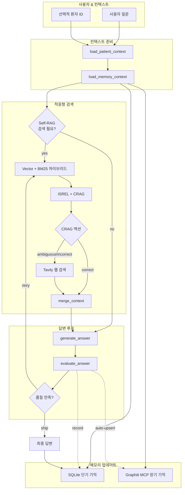

# 대사증후군 상담을 위한 Agentic RAG

🇰🇷 한국어 · [🇺🇸 English](README.md)

Self-RAG 기반 검색 제어와 Corrective RAG 분기, 그리고 이중 메모리(세션별 SQLite 단기 기억 + Graphiti MCP 장기 기억)를 결합한 상담 어시스턴트입니다.

---

## 📌 빠른 링크
- 데모 노트북/CLI → `examples/`
- 메모리 모듈 → `src/memory/`
- LangGraph 워크플로우 → `src/graph/workflow.py`
- 참고 문헌: [Agentic RAG 개요](https://nvidia.github.io/workbench-example-agentic-rag/), [Self-RAG 논문](https://github.com/akariasai/self-rag), [Corrective RAG(CRAG)](https://arxiv.org/abs/2401.15884)

---

## 🧠 시스템 개요



| 계층 | 저장소 | 목적 | 구현 위치 |
| --- | --- | --- | --- |
| 단기 기억 | SQLite (`session_id`, `turn` 기반) | 세션별 최근 대화, 요약 유지 | `src/memory/short_term.py`
| 장기 기억 | Graphiti MCP (Neo4j) | 세션 간 상담 지식 축적, 고품질 답변 자동 업서트 | `src/memory/graphiti.py`

> ✅ `ShortTermMemoryStore`는 `(session_id, turn)`를 기본 키로 사용하며 `get_context(session_id)`에서 세션별로 필터링합니다.

---

## ⚙️ 핵심 구성 요소

- **LangGraph 워크플로우**: Self-RAG 분기, CRAG 판단, 재생성 루프 (`src/graph/workflow.py`).
- **에이전트 노드**: Graphiti 기억을 프롬프트에 주입하고, 높은 품질의 답변을 자동 업서트 (`src/graph/nodes.py`).
- **메모리 커넥터**:
  - `short_term.py` → SQLite 다층 요약
  - `graphiti.py` → MCP 검색/저장을 위한 동기 래퍼
- **평가 로직**: Self-RAG 점수, CRAG 액션, ISSUP/ISUSE 평가 (`src/evaluation/`).
- **하이브리드 검색**: BM25 + Chroma 내부 검색, Tavily 외부 보강 (`src/data/vector_store.py`).

---

## 🚀 시작하기

```bash
uv sync  # 또는 pip install -r requirements.txt
python examples/run_cli.py
```

환경 변수 (예시):

| 변수 | 설명 |
| --- | --- |
| `OPENAI_API_KEY` | LLM 및 임베딩에 필수 |
| `GRAPHITI_MCP_TRANSPORT` | `stdio`, `sse`, `streamable_http` 중 하나 |
| `GRAPHITI_MCP_COMMAND` / `GRAPHITI_MCP_URL` | 트랜스포트별 연결 정보 |
| `GRAPHITI_MEMORY_NAMESPACE` | 기본값 `agentic-rag`, Graphiti 네임스페이스 구분 |
| `SHORT_TERM_MEMORY_DB` | (선택) SQLite 경로 지정 |

---

## 🧪 테스트

```bash
python -m unittest tests.test_long_term_memory_integration
```

Mock 기반 테스트로 Graphiti 없이도 업서트/스킵 경로를 검증합니다.

---

## 📚 참고 링크

- [Agentic RAG (NVIDIA)](https://nvidia.github.io/workbench-example-agentic-rag/)
- [Self-RAG Paper](https://github.com/akariasai/self-rag)
- [Corrective RAG (CRAG)](https://arxiv.org/abs/2401.15884)
- [LangChain MCP Adapters](https://github.com/langchain-ai/langchain-mcp-adapters)
- [Graphiti MCP Server](https://github.com/getzep/graphiti/tree/main/mcp_server)

---

## 🧾 라이선스 및 목적

대사증후군 상담 지원을 위한 연구/교육용 프로젝트입니다. 실제 진료는 반드시 전문 의료인의 판단을 따르세요.
