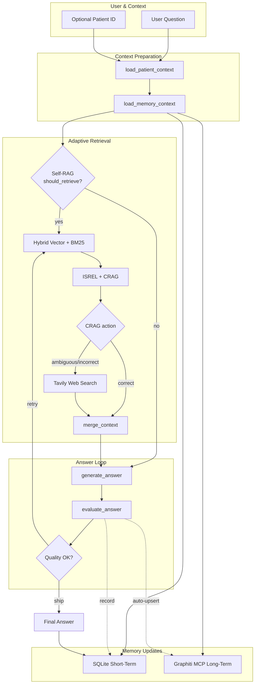

# Agentic RAG for Metabolic Syndrome Coaching

[🇰🇷 한국어](README.ko.md) · 🇺🇸 English

Concise agentic-RAG stack that blends **Self-RAG** retrieval control, **Corrective RAG** decisioning, and dual-layer memory (SQLite short-term + Graphiti MCP long-term) to support metabolic-syndrome counselling scenarios.

---

## 📌 Quick Links
- Demo notebook & CLI scripts → `examples/`
- Memory stores → `src/memory/`
- Core graph → `src/graph/workflow.py`
- References: [Agentic RAG overview](https://nvidia.github.io/workbench-example-agentic-rag/), [Self-RAG paper](https://github.com/akariasai/self-rag), [Corrective RAG (CRAG)](https://arxiv.org/abs/2401.15884)

---

## 🧠 System Snapshot



| Layer | Storage | Purpose | Implementation |
| --- | --- | --- | --- |
| Short-term | SQLite (`interactions` table keyed by `(session_id, turn)`) | Session-scoped transcripts, rolling summaries | `src/memory/short_term.py`
| Long-term | Graphiti MCP (Neo4j) | Cross-session recall, auto-upsert on quality answers | `src/memory/graphiti.py`

> ✅ Short-term memory is isolated per session ID (see `ShortTermMemoryStore.record_interaction` primary key and `get_context(session_id)` filter).

---

## ⚙️ Key Components

- **LangGraph workflow** (`src/graph/workflow.py`): orchestrates Self-RAG routing, CRAG branching, and regeneration loop.
- **Agent node toolset** (`src/graph/nodes.py`): injects Graphiti memories into prompts and auto-persists high-confidence answers back to Graphiti MCP.
- **Memory connectors** (`src/memory/`):
  - `short_term.py` → SQLite tiers (recent turns, history summary, topic summaries).
  - `graphiti.py` → sync wrappers over MCP search/upsert for LangGraph nodes.
- **Evaluators** (`src/evaluation/`) implement Self-RAG scoring, CRAG action selection, and ISSUP/ISUSE answer grading.
- **Hybrid retrieval** (`src/data/vector_store.py`) combines BM25 + Chroma for internal evidence; Tavily handles external fallback.

---

## 🚀 Get Started

```bash
uv sync  # or pip install -r requirements.txt
python examples/run_cli.py
```

Environment knobs (set via `.env` or shell):

| Variable | Notes |
| --- | --- |
| `OPENAI_API_KEY` | Required for LLM + embeddings |
| `GRAPHITI_MCP_TRANSPORT` | `stdio`, `sse`, or `streamable_http` |
| `GRAPHITI_MCP_COMMAND` / `GRAPHITI_MCP_URL` | Transport-specific connection info |
| `GRAPHITI_MEMORY_NAMESPACE` | Defaults to `agentic-rag`; namespaces Graphiti recalls |
| `SHORT_TERM_MEMORY_DB` | Optional custom path for SQLite cache |

---

## 🧪 Testing

```bash
python -m unittest tests.test_long_term_memory_integration
pytest  # optional full suite when added
```

The long-term memory test suite mocks Graphiti to validate auto-upsert and skip-path metadata without a live server.

---

## 📚 Further Reading

- [Agentic RAG (NVIDIA Workbench Example)](https://nvidia.github.io/workbench-example-agentic-rag/)
- [Self-RAG: LLMs with Retrieval, Generation, Critique](https://github.com/akariasai/self-rag)
- [Corrective Retrieval Augmented Generation (CRAG)](https://arxiv.org/abs/2401.15884)
- [LangChain MCP Adapters](https://github.com/langchain-ai/langchain-mcp-adapters)
- [Graphiti MCP Server](https://github.com/getzep/graphiti/tree/main/mcp_server)

---

## 🧾 License & Purpose

Educational research project for evidence-based metabolic syndrome coaching. Use responsibly; consult licensed medical professionals for clinical decisions.
