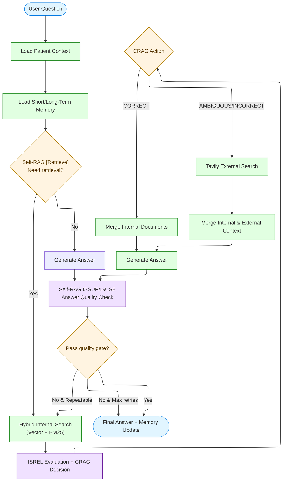

# Agentic RAG for Metabolic Syndrome Health Consultation

🇺🇸 English · [🇰🇷 한국어](README.ko.md)

**AI assistant for metabolic syndrome counselors**

This project delivers a LangGraph-based Agentic RAG system that combines Self-RAG Reflection Tokens with the Corrective RAG (CRAG) strategy to support professional-grade health consultations. Twenty sample patient scenarios stored in SQLite power personalized risk assessments, lifestyle guidance, and diagnostic summaries so counselors can respond with higher accuracy and confidence.

---

## 📋 Table of Contents

- [Key Features](#-key-features)
- [System Workflow](#-system-workflow)
- [Agentic RAG Implementation](#-agentic-rag-implementation)
- [SQLite Short-Term Memory + Graphiti MCP Long-Term Memory](#-sqlite-short-term-memory--graphiti-mcp-long-term-memory)
- [Metabolic Syndrome Scenarios](#-metabolic-syndrome-scenarios)
- [Project Structure](#-project-structure)
- [Tests](#-tests)
- [Installation & Run](#-installation--run)
- [Roadmap](#-roadmap)
- [Tech Stack](#-tech-stack)
- [License](#-license)
- [Contributing](#-contributing)
- [Contact](#-contact)

---

## 🎯 Key Features

### 1. **Purpose-Built AI Assistant for Counselors**
- **Real-time knowledge retrieval**: automatically pulls the latest metabolic syndrome research and guidelines.
- **Evidence-backed answers**: every answer carries a confidence score and cites supporting sources.
- **Patient-specific insights**: tailors guidance with structured health exam data for each scenario.
- **Quality assurance**: multi-stage evaluation ensures reliable, repeatable responses.

### 2. **Agentic RAG System**
- **Self-RAG Reflection Tokens**
  - `[Retrieve]`: decides when retrieval is required before generating an answer.
  - `ISREL`: judges the relevance of retrieved passages.
  - `ISSUP`: checks how well evidence supports the draft answer.
  - `ISUSE`: measures overall usefulness of the answer for the user’s question.
- **CRAG (Corrective RAG) strategy**
  - `CORRECT`: rely solely on internal knowledge when documentation is sufficient.
  - `INCORRECT`: fall back to external search if nothing relevant is found.
  - `AMBIGUOUS`: blend internal and external sources when evidence is borderline.
- **Batch Self-RAG evaluation + CRAG integration**
  - `evaluate_relevance_batch` with early stopping inspects only the minimum number of documents.
  - `evaluate_retrieval_and_decide_action` returns relevance scores and the CRAG rationale together.
  - `evaluate_answer_quality` combines ISSUP and ISUSE to decide whether to regenerate.
- **Conditional routing on LangGraph**
  - Dynamically branches based on retrieval necessity.
  - Switches between internal, external, or hybrid search according to CRAG.
  - Retries answer generation only when quality gates fail.

### 3. **Metabolic Syndrome Scenario Data**
- **20 sample patient cases** (JSON → SQLite) covering ages 20–60.
- **Diagnostics aligned with Korean metabolic syndrome criteria** (waist, blood pressure, glucose, triglycerides, HDL).
- **Per-patient analysis**: risk stratification (low / medium / high) with lifestyle recommendations.
- **Vectorized knowledge base**: metabolic syndrome medical literature embedded for hybrid retrieval (semantic + BM25).

### 4. **Graphiti MCP-Backed Short & Long-Term Memory**
- **langchain-mcp-adapter** connects Graphiti MCP to the LangGraph agent for persistent recall.
- **Short-term memory**: session transcripts stored in SQLite for immediate context.
- **Long-term memory**: consultation summaries saved to Graphiti MCP and retrievable across sessions.
- **Configurable transports**: `GRAPHITI_MCP_*` environment variables support stdio, HTTP, SSE, or WebSocket modes.

---

## 🔄 System Workflow



---

## 🤖 Agentic RAG Implementation

### Self-RAG Reflection Tokens

#### 1. **[Retrieve] — decide if retrieval is required**
```python
from src.evaluation import create_evaluator

evaluator = create_evaluator()

# Decide whether retrieval is needed
result = evaluator.evaluate_retrieve_need(
    "What diet should a metabolic syndrome patient follow?"
)
print(result.should_retrieve)  # "yes" | "no"  # TODO: add "continue" once contextual routing is wired
print(result.difficulty)  # "easy" | "normal" | "hard" | "none"
print(result.documents_to_evaluate)  # Number of documents per difficulty level
print(result.reason)    # LLM rationale
```

**Decision heuristic:**
- Questions requiring concrete facts → `yes`
- Light chit-chat or greetings → `no`

#### 2. **ISREL — evaluate retrieval relevance**
```python
# Score each document for relevance
evaluation = evaluator.assess_retrieval_quality(
    query="What are the diagnostic criteria for metabolic syndrome?",
    documents=retrieved_docs,
    min_relevant_docs=2
)

for doc_eval in evaluation.document_evaluations:
    print(f"Relevance: {doc_eval.relevance.relevance}")  # relevant / irrelevant
    print(f"Confidence: {doc_eval.relevance.confidence}")
```

#### 2-1. **Batch evaluation + CRAG decision in one call**
```python
# Evaluate only the minimum documents and stop early when possible
batch_results, early_stopped, evaluated = evaluator.evaluate_documents_with_early_stop(
    query="What are the diagnostic criteria for metabolic syndrome?",
    documents=retrieved_docs,
    min_relevant_docs=2,
)
if early_stopped:
    print(f"Stopped early after evaluating {evaluated} documents")

# Prompt A2: relevance + CRAG action + rationale in one response
combined = evaluator.evaluate_retrieval_and_decide_action(
    query="What are the diagnostic criteria for metabolic syndrome?",
    documents=retrieved_docs[:evaluated or len(retrieved_docs)],
    min_relevant_docs=2,
)

print(combined.crag_action)  # correct / incorrect / ambiguous
print(combined.reason)
for item in combined.document_evaluations:
    print(item.doc_id, item.relevance, item.score)
```

#### 3. **ISSUP — check documentary support**
```python
# How strongly do the documents support the answer? (batch mode)
support_results = evaluator.evaluate_support_batch(
    query="Question",
    documents=["Supporting document"],
    answer="Generated answer",
)
print(f"Support: {support_results[0].support}")  # fully_supported / partially_supported / no_support
```

#### 4. **ISUSE — measure answer usefulness**
```python
# Overall usefulness for the user question (uses integrated result)
answer_quality = evaluator.evaluate_answer_quality(
    query="Question",
    answer="Generated answer",
    documents=["Supporting document"],
)
print(f"Usefulness: {answer_quality.usefulness_score}/5.0")
print(f"Confidence: {answer_quality.usefulness_confidence:.2f}")
print(f"Should regenerate: {answer_quality.should_regenerate}")
print(f"Reason: {answer_quality.regenerate_reason}")
```

### CRAG (Corrective RAG) Strategy

```python
from src.strategies import create_corrective_rag

crag = create_corrective_rag(min_relevant_docs=2)

# Decide the CRAG action
result = crag.execute(
    query="What are the latest studies on metabolic syndrome?",
    documents=internal_docs
)

print(result.action)  # CORRECT / INCORRECT / AMBIGUOUS
print(result.reason)
print(result.web_search_performed)
print(result.documents)  # Final list of documents to use
```

CRAG records the LLM rationale in `result.reason` and appends `crag_relevance`, `crag_confidence`, and `crag_score` metadata to selected documents. LangGraph nodes store `early_stopped`, `evaluated_docs_count`, `crag_reason`, and similar fields to simplify debugging and monitoring.

**Action logic:**
- `CORRECT`: relevant docs ≥ `min_relevant_docs` → use internal sources only.
- `INCORRECT`: no relevant docs → rely entirely on external search.
- `AMBIGUOUS`: in-between cases → mix internal and external sources.

### LangGraph Workflow Execution

```python
from src.graph.workflow import run_rag

# Generic question
result = run_rag("What are the diagnostic criteria for metabolic syndrome?")

# Patient-specific question
result = run_rag(
    "How can I improve my condition?",
    patient_id=1
)

print(result["answer"])
print(f"Performed retrieval: {result['should_retrieve']}")
print(f"CRAG action: {result['crag_action']}")
print(f"Answer quality: ISSUP={result['support_score']}, ISUSE={result['usefulness_score']}")
```

---

## 🧠 SQLite Short-Term Memory + Graphiti MCP Long-Term Memory

Short-term memory is handled by `ShortTermMemoryStore` in `src/memory/short_term.py`, which persists context to SQLite. Long-term memory is managed by `GraphitiMCPConnector` in `src/memory/graphiti.py`, connecting to a Graphiti MCP server. When Graphiti is unavailable, the agent safely degrades to short-term memory only.

### 1. Required environment variables

```
GRAPHITI_MCP_TRANSPORT=stdio            # or streamable_http / sse / websocket
GRAPHITI_MCP_COMMAND=graphiti-mcp       # command to launch the server in stdio mode
GRAPHITI_MCP_ARGS="serve --workspace /path/to/workspace"
# or for HTTP-based transports
# GRAPHITI_MCP_URL=https://graphiti.example.com/mcp
```

Optional extras:

```
GRAPHITI_MCP_HEADERS='{"Authorization": "Bearer ..."}'
GRAPHITI_MCP_ENV='{"GRAPHITI_API_KEY": "..."}'
GRAPHITI_MEMORY_NAMESPACE=metabolic-syndrome
GRAPHITI_MEMORY_SEARCH_LIMIT=5
GRAPHITI_MCP_SEARCH_TOOL=graphiti.search_memories
GRAPHITI_MCP_UPSERT_TOOL=graphiti.upsert_memory
GRAPHITI_MEMORY_TAGS='["agentic-rag"]'
# Optional SQLite path for short-term memory
# SHORT_TERM_MEMORY_DB=/path/to/memory.sqlite3
```

### 2. Memory flow

1. `load_memory_context_node` loads recent SQLite history into the LangGraph state.
   - Latest 3 turns → stored verbatim
   - Turns 4–9 → conversation summaries
   - 10+ turns → topic summaries
2. `generate_answer_node` exposes `graphiti_search_memories` and `graphiti_upsert_memory` tools so the LLM can search or update long-term memory on demand.
3. `evaluate_answer_node` records the outcome in SQLite after evaluating answer quality (long-term storage is triggered by explicit tool calls).

If Graphiti is not configured, the SQLite short-term memory remains active while long-term tools are automatically disabled.

---

## 🏥 Metabolic Syndrome Scenarios

### Patient database (SQLite)

Twenty patient scenarios are defined in `health_cases.json` and converted into the `health_scenarios_v2.sqlite` database through `build_health_scenarios_v2.py`.

#### Database schema

```sql
-- Patient master table
CREATE TABLE patients (
  patient_id     INTEGER PRIMARY KEY AUTOINCREMENT,
  name           TEXT NOT NULL,
  sex            TEXT CHECK (sex IN ('남','여')),
  age            INTEGER,
  rrn_masked     TEXT,
  registered_at  TIMESTAMP DEFAULT CURRENT_TIMESTAMP
);

-- Health exams + measurements
CREATE TABLE health_exams (
  exam_id            INTEGER PRIMARY KEY AUTOINCREMENT,
  patient_id         INTEGER NOT NULL,
  exam_at            TIMESTAMP NOT NULL,
  facility_name      TEXT,
  doc_registered_on  DATE,
  -- Body composition
  height_cm          REAL,
  weight_kg          REAL,
  bmi                REAL,
  -- Five metabolic syndrome criteria
  waist_cm           REAL,
  systolic_mmHg      INTEGER,
  diastolic_mmHg     INTEGER,
  fbg_mg_dl          REAL,
  tg_mg_dl           REAL,
  hdl_mg_dl          REAL,
  -- Additional lipid panel
  tc_mg_dl           REAL,
  ldl_mg_dl          REAL,
  FOREIGN KEY (patient_id) REFERENCES patients(patient_id)
);
```

#### Querying the database

```python
from src.data import PatientDatabase

db = PatientDatabase()

# Fetch a patient profile
patient = db.get_patient(patient_id=1)
print(f"{patient['name']}, {patient['sex']}, {patient['age']} years old")

# Latest exam
exam = db.get_latest_exam(patient_id=1)
print(f"Waist circumference: {exam['waist_cm']} cm")
print(f"Blood pressure: {exam['systolic_mmhg']}/{exam['diastolic_mmhg']} mmHg")
print(f"Fasting glucose: {exam['fbg_mg_dl']} mg/dL")

# Aggregate statistics
stats = db.get_statistics()
print(f"Total patients: {stats['total_patients']}")
print(f"Metabolic syndrome: {stats['metabolic_syndrome_patients']}")
```

### Diagnostic criteria (Korean guidelines)

Metabolic syndrome is diagnosed when **three or more** of the following are present:

| Criterion | Male | Female |
|-----------|------|--------|
| **Abdominal obesity** | Waist ≥ 90 cm | Waist ≥ 85 cm |
| **Hypertension** | Systolic ≥ 130 or diastolic ≥ 85 mmHg | (same) |
| **Fasting glucose impairment** | Fasting glucose ≥ 100 mg/dL | (same) |
| **Hypertriglyceridemia** | Triglycerides ≥ 150 mg/dL | (same) |
| **Low HDL cholesterol** | HDL < 40 mg/dL | HDL < 50 mg/dL |

### Diagnostic & risk evaluation

```python
# Determine metabolic syndrome status
diagnosis = db.check_metabolic_syndrome(patient_id=1)
print(f"Metabolic syndrome: {diagnosis['has_metabolic_syndrome']}")
print(f"Criteria met: {diagnosis['criteria_met']}/5")
print(f"Risk factors: {diagnosis['risk_factors']}")

# Risk level
risk = db.evaluate_risk_level(patient_id=1)
print(f"Risk level: {risk['risk_label']}")  # low / medium / high
print(f"Description: {risk['risk_description']}")

# Build a diagnostic report
report = db.generate_diagnostic_report(patient_id=1)
print(report)
```

### Integrating patient context

```python
from src.data import PatientContextProvider

provider = PatientContextProvider()

# Context block injected into RAG queries
context = provider.get_patient_context(patient_id=1)
print(context)
# Example output:
# """
# [Patient]
# - Name: Kim Seo-jun
# - Gender: Male, Age: 26
# - Registered on: 2024-03-01
#
# [Latest exam (2025-08-12)]
# - Body: 175.0 cm, 68.0 kg, BMI 22.2
# - Waist: 82.0 cm
# - Blood pressure: 118/74 mmHg
# - Fasting glucose: 92.0 mg/dL
# - Lipids: TC 180.0, TG 95.0, HDL 58.0, LDL 105.0 mg/dL
#
# [Metabolic syndrome]
# Does not qualify (criteria met: 0/5)
# """
```

### Sample patient overview

The 20 cases cover a broad age range with diverse metabolic syndrome risk levels:

| Patient ID | Name | Sex/Age | Diagnosis | Notes |
|------------|------|---------|-----------|-------|
| 1 | Kim Seo-jun | Male / 26 | Normal | Ideal health profile |
| 2 | Han Ye-rin | Female / 24 | Underweight | Underweight with all metrics in range |
| 3 | Oh Da-in | Female / 25 | Normal | Maintains ideal markers |
| 4 | Choi Min-jun | Male / 28 | **Metabolic syndrome** | Obesity plus multiple risk factors |
| 5 | Lee Do-yoon | Female / 32 | **Metabolic syndrome** | Severe case (meets all five criteria) |
| ... | ... | ... | ... | ... |
| 20 | ... | ... | ... | Twenty total cases spanning ages 20–60 |

**Distribution highlights:**
- Ages: evenly distributed from 20s to 60s.
- Diagnosis: from healthy to high-risk metabolic syndrome cases.
- Gender: balanced mix of male and female patients.

---

## 📁 Project Structure

```
.
├── src/
│   ├── data/                      # Data loaders & utilities
│   │   ├── __init__.py
│   │   ├── document_loader.py     # Markdown ingestion & chunking
│   │   ├── embeddings.py          # OpenAI embeddings
│   │   ├── vector_store.py        # ChromaDB + hybrid retrieval
│   │   ├── patient_db.py          # SQLite patient database helpers
│   │   ├── patient_context.py     # Patient context provider
│   │   └── path_utils.py          # Path utilities
│   │
│   ├── evaluation/                # Self-RAG evaluation helpers
│   │   ├── __init__.py
│   │   └── self_rag_evaluator.py  # [Retrieve], ISREL, ISSUP, ISUSE
│   │
│   ├── strategies/                # CRAG policies
│   │   ├── __init__.py
│   │   └── corrective_rag.py      # CORRECT / INCORRECT / AMBIGUOUS
│   │
│   ├── graph/                     # LangGraph workflow
│   │   ├── __init__.py
│   │   ├── state.py               # RAGState definition
│   │   ├── nodes.py               # Node implementations
│   │   └── workflow.py            # Graph build & execution
│   │
│   └── tools/                     # External tool connectors
│       ├── __init__.py
│       └── tavily.py              # Tavily web search client
│
├── tests/                         # Unit & integration tests
│   └── ...
│
├── examples/                      # Example scripts
│   ├── cli_simple.py              # Minimal CLI interface
│   ├── self_rag_evaluation_demo.py
│   └── crag_demo.py
│
├── metabolic_syndrome_data/       # Knowledge base documents
│   ├── raw/                       # Source materials
│   └── parsed/                    # Parsed documents
│
├── chromadb/                      # Vector database files
│   └── openai/                    # Embedding store
│
├── health_scenarios_v2.sqlite     # Patient database (SQLite)
├── health_cases.json              # 20 patient scenarios
├── build_health_scenarios_v2.py   # JSON → SQLite builder
├── .env                           # Environment variables (API keys)
├── .gitignore
└── README.md
```

## ✅ Tests

- `tests/test_batch_evaluation.py`: validates batch relevance scoring, early stopping, and graph metadata.
- `tests/test_combined_evaluation.py`: unit-tests the CRAG prompt and integrated answer evaluation.
- `tests/test_self_rag_evaluator.py`: exercises the migrated Self-RAG batch APIs.

---

## 🚀 Installation & Run

### 1. Environment setup

```bash
# Clone repository
git clone <repository-url>
cd <project-directory>

# Create a virtual environment (recommended)
python -m venv venv
source venv/bin/activate  # Windows: venv\Scripts\activate

# Install dependencies
pip install -r requirements.txt
```

### 2. API keys

Create a `.env` file:
```bash
OPENAI_API_KEY=your-openai-api-key
TAVILY_API_KEY=your-tavily-api-key  # optional
```

### 3. Build the databases

```bash
# Generate the 20-case patient database (health_cases.json → SQLite)
python build_health_scenarios_v2.py

# Build the vector store (metabolic syndrome knowledge base)
python -m src.data.vector_store
```

### 4. Run the CLI interface

```bash
python examples/cli_simple.py
```

**Execution flow:**
1. Display patients sorted by most recent exam.
2. Select a patient (or continue without context).
3. Ask questions and receive grounded answers.
4. Exit with `exit` or `quit`.

**Example:**
```
======================================================================
Patient list (most recent exam first)
======================================================================
[1] Kim Seo-jun (Male, 26) - Exam: 2025-08-12 09:30:00
[2] Han Ye-rin (Female, 24) - Exam: 2025-08-23 11:05:00
...
[0] Continue without patient context
======================================================================

Select a patient: 1

Selected: Kim Seo-jun (Male, 26)

======================================================================
Type your question (exit with "exit" or "quit")
======================================================================

Q> What are the diagnostic criteria for metabolic syndrome?

[Processing...]

======================================================================
[Answer]
======================================================================
Metabolic syndrome is diagnosed when three or more of the following five risk factors are present:
...
======================================================================
```

---

## 🔮 Roadmap

- Implement long-term/short-term agent memory using Graphiti MCP (planned).

---

## 📚 Tech Stack

### Core Framework
- **LangGraph**: conditional branching & workflow orchestration.
- **LangChain**: RAG pipeline composition.

### AI/ML
- **LLM**: OpenAI GPT-5-mini for answer generation and evaluation.
- **Embeddings**: OpenAI `text-embedding-3-small`.

### Data & Search
- **Vector DB**: ChromaDB for semantic retrieval.
- **Keyword Search**: BM25 for hybrid search.
- **External Search**: Tavily for web grounding.
- **Patient DB**: SQLite with 20 patient scenarios.

### Memory (roadmap)
- **Knowledge graph**: Neo4j + Graphiti MCP for long-term consultation history.

### Use Case
- **Metabolic syndrome counselor assistant** delivering evidence-based guidance.

---

## 📄 License

This project is provided for educational and research purposes.

---

## 👥 Contributing

The system explores how Agentic RAG techniques can assist healthcare professionals during metabolic syndrome consultations. Contributions that improve reliability, evaluation, or memory integration are welcome.

---

## 📧 Contact

Please open a GitHub Issue for project questions or suggestions.
