# Agentic RAG for Metabolic Syndrome Health Consultation

**대사증후군 상담사를 위한 AI 어시스턴트**

LangGraph 기반 Agentic RAG 시스템으로, Self-RAG의 Reflection Tokens와 CRAG의 Corrective Strategy를 결합하여 상담사의 전문적인 건강 상담을 지원합니다. 20개의 샘플 환자 시나리오 데이터(SQLite DB)를 기반으로 개인별 맞춤형 건강 정보와 진단 결과를 제공하며, 상담사가 보다 정확하고 신뢰할 수 있는 상담을 제공할 수 있도록 돕습니다.

---

## 📋 목차

- [주요 특징](#-주요-특징)
- [시스템 워크플로우](#-시스템-워크플로우)
- [Agentic RAG 구현](#-agentic-rag-구현)
- [대사증후군 시나리오](#-대사증후군-시나리오)
- [프로젝트 구조](#-프로젝트-구조)
- [설치 및 실행](#-설치-및-실행)
- [향후 계획](#-향후-계획)

---

## 🎯 주요 특징

### 1. **상담사를 위한 AI 어시스턴트**
- **실시간 정보 검색**: 대사증후군 관련 최신 의료 지식 자동 검색
- **근거 기반 답변**: 모든 답변에 대한 신뢰도 평가 및 출처 제공
- **환자별 맞춤 분석**: 개별 환자의 검진 데이터 기반 상담 지원
- **품질 보증**: 다단계 평가를 통한 답변 신뢰성 확보

### 2. **Agentic RAG 시스템**
- **Self-RAG Reflection Tokens** 구현
  - `[Retrieve]`: 검색 필요성 자동 판단
  - `ISREL`: 검색 결과 관련성 평가
  - `ISSUP`: 답변의 문서 지원도 평가
  - `ISUSE`: 답변의 유용성 평가

- **CRAG (Corrective RAG) 전략**
  - `CORRECT`: 내부 문서만으로 충분한 경우
  - `INCORRECT`: 외부 검색으로 완전 대체
  - `AMBIGUOUS`: 내부/외부 문서 혼합 사용

- **배치 Self-RAG 평가 & CRAG 통합**
  - `evaluate_relevance_batch` + 조기 종료로 최소 문서만 평가
  - `evaluate_retrieval_and_decide_action`이 관련성 점수와 CRAG 사유를 동시에 제공
  - `evaluate_answer_quality`가 ISSUP/ISUSE를 통합하고 재생성 여부를 판단

- **LangGraph 기반 조건부 분기**
  - 검색 필요성에 따른 동적 라우팅
  - CRAG 액션에 따른 외부 검색 제어
  - 답변 품질 기반 재생성 로직

### 3. **대사증후군 시나리오 데이터**
- **20개의 샘플 환자 시나리오** (JSON → SQLite DB)
  - 연령대: 20~60대 분포
  - 대사증후군 진단 기준: 한국인 기준 적용
  - 건강 검진 데이터: 체성분, 혈압, 혈당, 지질 검사

- **환자별 맞춤형 분석**
  - 개인 건강 상태 분석
  - 대사증후군 위험도 평가 (저/중/고위험)
  - 맞춤형 생활습관 개선 권장사항

- **벡터 기반 지식베이스**
  - 대사증후군 관련 의료 문서 임베딩
  - Hybrid Retrieval (Semantic + BM25)

### 4. **Graphiti MCP 기반 장·단기 기억**
- **langchain-mcp-adapter**로 Graphiti MCP 서버를 LangGraph Agent에 연결
- **단기 기억**: 세션 내 최근 QA를 메모리 버퍼에 보관하여 즉각적인 회상 지원
- **장기 기억**: Graphiti MCP에 상담 로그를 영속화하고 세션별로 검색
- **유연한 설정**: `GRAPHITI_MCP_*` 환경 변수를 통해 stdio/HTTP 등 다양한 트랜스포트를 구성

---

## 🔄 시스템 워크플로우

```mermaid
---
config:
  layout: elk
---
flowchart TB
    USER(["사용자 질문"]) --> LOAD_PATIENT["환자 컨텍스트 로드"]
    LOAD_PATIENT --> LOAD_MEMORY["단기/장기 메모리 컨텍스트 로드"]
    LOAD_MEMORY --> RETRIEVE_DECISION{"Self-RAG [Retrieve]
검색 필요?"}
    RETRIEVE_DECISION -- 예 --> INTERNAL_SEARCH["하이브리드 내부 검색
(Vector + BM25)"]
    RETRIEVE_DECISION -- 아니오 --> DIRECT_ANSWER["LLM 답변 생성"]
    INTERNAL_SEARCH --> ISREL_CRAG["ISREL 평가 + CRAG 결정"]
    ISREL_CRAG --> CRAG_DECISION{"CRAG 액션"}
    CRAG_DECISION -- CORRECT --> MERGE_INTERNAL["내부 문서만 병합"]
    CRAG_DECISION -- AMBIGUOUS/INCORRECT --> EXTERNAL_SEARCH["Tavily 외부 검색"]
    EXTERNAL_SEARCH --> MERGE_MIXED["내부·외부 문서 병합"]
    MERGE_INTERNAL --> GENERATE["LLM 답변 생성"]
    MERGE_MIXED --> GENERATE
    DIRECT_ANSWER --> EVAL
    GENERATE --> EVAL["Self-RAG ISSUP/ISUSE
답변 품질 평가"]
    EVAL --> QUALITY_GATE{"품질 기준 충족?"}
    QUALITY_GATE -- 예 --> FINAL(["최종 답변 반환 + 메모리 업데이트"])
    QUALITY_GATE -- 아니오 & 반복 가능 --> INTERNAL_SEARCH
    QUALITY_GATE -- 아니오 & 최대 반복 도달 --> FINAL

    classDef decision fill:#fff4e1,stroke:#b8860b,color:#5b3a00;
    classDef process fill:#e1ffe1,stroke:#228b22;
    classDef io fill:#e1f5ff,stroke:#1e88e5;
    classDef eval fill:#f0e1ff,stroke:#6a1b9a;

    class USER,FINAL io;
    class LOAD_PATIENT,LOAD_MEMORY,INTERNAL_SEARCH,EXTERNAL_SEARCH,MERGE_INTERNAL,MERGE_MIXED,GENERATE process;
    class RETRIEVE_DECISION,CRAG_DECISION,QUALITY_GATE decision;
    class ISREL_CRAG,EVAL eval;
```




---

## 🤖 Agentic RAG 구현

### Self-RAG Reflection Tokens

#### 1. **[Retrieve] - 검색 필요성 판단**
```python
from src.evaluation import create_evaluator

evaluator = create_evaluator()

# 검색 필요 판단
result = evaluator.evaluate_retrieve_need(
    "대사증후군 환자를 위한 식단은?"
)
print(result.should_retrieve)  # "yes" | "no"  # TODO: add "continue" once contextual routing is wired
print(result.difficulty)  # "easy" | "normal" | "hard" | "none"
print(result.documents_to_evaluate)  # 난이도별 평가 문서 수
print(result.reason)    # 판단 근거
```

---

## 🧠 SQLite 단기 기억 + Graphiti MCP 장기 기억

단기 기억은 `src/memory/short_term.py`의 `ShortTermMemoryStore`가 SQLite에 저장하며,
장기 기억은 `src/memory/graphiti.py`의 `GraphitiMCPConnector`가 Graphiti MCP 서버를 통해 관리합니다.
Graphiti 서버 정보가 없으면 단기 기억만으로 안전하게 동작합니다.

### 1. 필수 환경 변수

```
GRAPHITI_MCP_TRANSPORT=stdio            # 또는 streamable_http / sse / websocket
GRAPHITI_MCP_COMMAND=graphiti-mcp       # stdio 사용 시 서버 실행 커맨드
GRAPHITI_MCP_ARGS="serve --workspace /path/to/workspace"
# 또는 HTTP 기반 사용 시
# GRAPHITI_MCP_URL=https://graphiti.example.com/mcp
```

필요 시 아래 옵션도 사용할 수 있습니다.

```
GRAPHITI_MCP_HEADERS='{"Authorization": "Bearer ..."}'
GRAPHITI_MCP_ENV='{"GRAPHITI_API_KEY": "..."}'
GRAPHITI_MEMORY_NAMESPACE=metabolic-syndrome
GRAPHITI_MEMORY_SEARCH_LIMIT=5
GRAPHITI_MCP_SEARCH_TOOL=graphiti.search_memories
GRAPHITI_MCP_UPSERT_TOOL=graphiti.upsert_memory
GRAPHITI_MEMORY_TAGS='["agentic-rag"]'
# 단기 기억 DB 경로 (선택)
# SHORT_TERM_MEMORY_DB=/path/to/memory.sqlite3
```

### 2. 메모리 흐름

1. `load_memory_context_node`가 SQLite에 저장된 단기 기억을 불러와 LangGraph 상태에 주입합니다.  
   - 최근 3턴: 원문 그대로  
   - 4~9턴: 히스토리 요약  
   - 10턴 이후: 주제별 요약
2. `generate_answer_node`는 `graphiti_search_memories`, `graphiti_upsert_memory` 도구를 에이전트에 노출해 LLM이 필요할 때 장기 기억을 조회하거나 업데이트하도록 합니다.
3. `evaluate_answer_node`는 답변 품질을 계산한 뒤 대화 내용을 SQLite 단기 기억에 기록합니다(장기 기억 저장은 에이전트의 도구 호출로 처리).

Graphiti 구성이 없더라도 단기 기억은 SQLite로 유지되며, 장기 기억 관련 도구는 자동으로 비활성화됩니다.

**판단 기준:**
- 구체적인 사실 정보 필요 → `yes`
- 일반 상식이나 인사말 → `no`

#### 2. **ISREL - 검색 결과 관련성 평가**
```python
# 문서별 관련성 평가
evaluation = evaluator.assess_retrieval_quality(
    query="대사증후군 진단 기준은?",
    documents=retrieved_docs,
    min_relevant_docs=2
)

for doc_eval in evaluation.document_evaluations:
    print(f"관련성: {doc_eval.relevance.relevance}")  # relevant/irrelevant
    print(f"신뢰도: {doc_eval.relevance.confidence}")
```

#### 2-1. **배치 평가 + CRAG 액션 동시 결정**
```python
# 최소 문서만 평가하고 싶은 경우 조기 종료 사용
batch_results, early_stopped, evaluated = evaluator.evaluate_documents_with_early_stop(
    query="대사증후군 진단 기준은?",
    documents=retrieved_docs,
    min_relevant_docs=2,
)
if early_stopped:
    print(f"{evaluated}개 문서만 평가하고 조기 종료")

# Prompt A2 기반 통합 평가: 관련성 + CRAG 액션 + 사유
combined = evaluator.evaluate_retrieval_and_decide_action(
    query="대사증후군 진단 기준은?",
    documents=retrieved_docs[:evaluated or len(retrieved_docs)],
    min_relevant_docs=2,
)

print(combined.crag_action)  # correct / incorrect / ambiguous
print(combined.reason)
for item in combined.document_evaluations:
    print(item.doc_id, item.relevance, item.score)
```

#### 3. **ISSUP - 답변 지원도 평가**
```python
# 답변이 문서에 의해 얼마나 뒷받침되는지 평가 (배치)
support_results = evaluator.evaluate_support_batch(
    query="질문",
    documents=["참고 문서"],
    answer="생성된 답변",
)
print(f"지원도: {support_results[0].support}")  # fully_supported / partially_supported / no_support
```

#### 4. **ISUSE - 답변 유용성 평가**
```python
# 답변이 사용자 질문에 얼마나 유용한지 평가 (통합 결과 활용)
answer_quality = evaluator.evaluate_answer_quality(
    query="질문",
    answer="생성된 답변",
    documents=["참고 문서"],
)
print(f"유용성: {answer_quality.usefulness_score}/5.0")
print(f"신뢰도: {answer_quality.usefulness_confidence:.2f}")
print(f"재생성 필요 여부: {answer_quality.should_regenerate}")
print(f"사유: {answer_quality.regenerate_reason}")
```

### CRAG (Corrective RAG) 전략

```python
from src.strategies import create_corrective_rag

crag = create_corrective_rag(min_relevant_docs=2)

# CRAG 액션 결정
result = crag.execute(
    query="대사증후군 최신 연구는?",
    documents=internal_docs
)

print(result.action)  # CORRECT / INCORRECT / AMBIGUOUS
print(result.reason)
print(result.web_search_performed)
print(result.documents)  # 최종 사용할 문서 리스트
```

CRAG은 Self-RAG 평가 결과를 그대로 활용해 `result.reason`에 LLM 판단 근거를 남기고,
선별된 문서에는 `crag_relevance`, `crag_confidence`, `crag_score` 메타데이터를 추가합니다.
LangGraph 노드는 `metadata` 필드에 `early_stopped`, `evaluated_docs_count`, `crag_reason`
등을 저장해 디버깅과 모니터링을 쉽게 합니다.

**액션 결정 로직:**
- `CORRECT`: 관련 문서 ≥ min_relevant_docs → 내부 문서만 사용
- `INCORRECT`: 관련 문서 = 0 → 외부 검색으로 대체
- `AMBIGUOUS`: 0 < 관련 문서 < min_relevant_docs → 내부+외부 혼합

### LangGraph 워크플로우 실행

```python
from src.graph.workflow import run_rag

# 일반 질문
result = run_rag("대사증후군의 진단 기준은?")

# 환자별 맞춤 질문
result = run_rag(
    "제 상태를 개선하려면?",
    patient_id=1
)

print(result["answer"])
print(f"검색 수행: {result['should_retrieve']}")
print(f"CRAG 액션: {result['crag_action']}")
print(f"답변 품질: ISSUP={result['support_score']}, ISUSE={result['usefulness_score']}")
```

---

## 🏥 대사증후군 시나리오

### 환자 데이터베이스 (SQLite)

**20개의 샘플 환자 시나리오**가 `health_cases.json` 파일로 정의되어 있으며, `build_health_scenarios_v2.py` 스크립트를 통해 `health_scenarios_v2.sqlite` SQLite 데이터베이스로 구축됩니다.

#### 데이터베이스 스키마

```sql
-- 환자 기본 정보
CREATE TABLE patients (
  patient_id     INTEGER PRIMARY KEY AUTOINCREMENT,
  name           TEXT NOT NULL,
  sex            TEXT CHECK (sex IN ('남','여')),
  age            INTEGER,
  rrn_masked     TEXT,
  registered_at  TIMESTAMP DEFAULT CURRENT_TIMESTAMP
);

-- 검진 정보 + 측정 데이터
CREATE TABLE health_exams (
  exam_id            INTEGER PRIMARY KEY AUTOINCREMENT,
  patient_id         INTEGER NOT NULL,
  exam_at            TIMESTAMP NOT NULL,
  facility_name      TEXT,
  doc_registered_on  DATE,
  -- 신체 측정
  height_cm          REAL,
  weight_kg          REAL,
  bmi                REAL,
  -- 대사증후군 진단 기준 5가지
  waist_cm           REAL,
  systolic_mmHg      INTEGER,
  diastolic_mmHg     INTEGER,
  fbg_mg_dl          REAL,
  tg_mg_dl           REAL,
  hdl_mg_dl          REAL,
  -- 추가 지질 검사
  tc_mg_dl           REAL,
  ldl_mg_dl          REAL,
  FOREIGN KEY (patient_id) REFERENCES patients(patient_id)
);
```

#### 데이터베이스 조회

```python
from src.data import PatientDatabase

db = PatientDatabase()

# 환자 정보 조회
patient = db.get_patient(patient_id=1)
print(f"{patient['name']}, {patient['sex']}, {patient['age']}세")

# 최신 검진 결과
exam = db.get_latest_exam(patient_id=1)
print(f"허리둘레: {exam['waist_cm']}cm")
print(f"혈압: {exam['systolic_mmhg']}/{exam['diastolic_mmhg']} mmHg")
print(f"공복혈당: {exam['fbg_mg_dl']} mg/dL")

# 전체 통계
stats = db.get_statistics()
print(f"총 환자 수: {stats['total_patients']}명")
print(f"대사증후군 환자: {stats['metabolic_syndrome_patients']}명")
```

### 대사증후군 진단 기준 (한국인)

다음 5가지 중 **3개 이상** 해당 시 대사증후군 진단:

| 기준 | 남성 | 여성 |
|------|------|------|
| **복부비만** | 허리둘레 ≥90cm | 허리둘레 ≥85cm |
| **고혈압** | 수축기 ≥130 또는 이완기 ≥85 mmHg | (동일) |
| **공복혈당장애** | 공복혈당 ≥100 mg/dL | (동일) |
| **고중성지방** | 중성지방 ≥150 mg/dL | (동일) |
| **저HDL콜레스테롤** | HDL <40 mg/dL | HDL <50 mg/dL |

### 진단 및 위험도 평가

```python
# 대사증후군 진단
diagnosis = db.check_metabolic_syndrome(patient_id=1)
print(f"대사증후군 여부: {diagnosis['has_metabolic_syndrome']}")
print(f"충족 기준 수: {diagnosis['criteria_met']}/5")
print(f"위험 요인: {diagnosis['risk_factors']}")

# 위험도 레벨 평가
risk = db.evaluate_risk_level(patient_id=1)
print(f"위험도: {risk['risk_label']}")  # 저위험/중위험/고위험
print(f"설명: {risk['risk_description']}")

# 진단 보고서 생성
report = db.generate_diagnostic_report(patient_id=1)
print(report)
```

### 환자 컨텍스트 통합

```python
from src.data import PatientContextProvider

provider = PatientContextProvider()

# 환자 컨텍스트 생성 (RAG 질의에 포함)
context = provider.get_patient_context(patient_id=1)
print(context)
# 출력 예시:
# """
# [환자 정보]
# - 이름: 김서준
# - 성별: 남, 나이: 26세
# - 등록일: 2024-03-01
# 
# [최신 검진 결과 (2025-08-12)]
# - 신체: 키 175.0cm, 체중 68.0kg, BMI 22.2
# - 허리둘레: 82.0cm
# - 혈압: 118/74 mmHg
# - 공복혈당: 92.0 mg/dL
# - 지질: TC 180.0, TG 95.0, HDL 58.0, LDL 105.0 mg/dL
# 
# [대사증후군 진단]
# 현재 대사증후군 해당하지 않음 (충족 기준: 0/5)
# """
```

### 샘플 환자 개요

20개의 환자 시나리오는 연령대별로 분포되어 있으며, 다양한 대사증후군 위험도를 포함합니다:

| 환자ID | 이름 | 성별/나이 | 진단 상태 | 특징 |
|--------|------|-----------|-----------|------|
| 1 | 김서준 | 남/26세 | 정상 | 이상적인 건강 상태 |
| 2 | 한예린 | 여/24세 | 저체중 | 저체중, 모든 지표 정상 |
| 3 | 오다인 | 여/25세 | 정상 | 이상적 수치 유지 |
| 4 | 최민준 | 남/28세 | **대사증후군** | 비만 + 복합 위험인자 |
| 5 | 이도윤 | 여/32세 | **대사증후군** | 심각한 대사증후군 (5개 모두 충족) |
| ... | ... | ... | ... | ... |
| 20 | ... | ... | ... | 총 20명 (20~60대 분포) |

**분포 특성:**
- 연령대: 20대~60대 고루 분포
- 대사증후군 환자: 정상부터 고위험까지 다양
- 성별: 남성/여성 균형적 분포

---

## 📁 프로젝트 구조

```
.
├── src/
│   ├── data/                      # 데이터 처리
│   │   ├── __init__.py
│   │   ├── document_loader.py     # 마크다운 문서 로드 및 청킹
│   │   ├── embeddings.py          # OpenAI 임베딩
│   │   ├── vector_store.py        # ChromaDB + Hybrid Retrieval
│   │   ├── patient_db.py          # 환자 데이터베이스 (SQLite)
│   │   ├── patient_context.py     # 환자 컨텍스트 제공자
│   │   └── path_utils.py          # 경로 유틸리티
│   │
│   ├── evaluation/                # Self-RAG 평가
│   │   ├── __init__.py
│   │   └── self_rag_evaluator.py  # [Retrieve], ISREL, ISSUP, ISUSE
│   │
│   ├── strategies/                # CRAG 전략
│   │   ├── __init__.py
│   │   └── corrective_rag.py      # CORRECT/INCORRECT/AMBIGUOUS
│   │
│   ├── graph/                     # LangGraph 워크플로우
│   │   ├── __init__.py
│   │   ├── state.py               # RAGState 정의
│   │   ├── nodes.py               # 노드 구현
│   │   └── workflow.py            # 그래프 빌드 및 실행
│   │
│   └── tools/                     # 외부 도구
│       ├── __init__.py
│       └── tavily.py              # Tavily 웹 검색
│
├── tests/                         # 테스트 코드
│   └── ...                        # 단위 테스트 및 통합 테스트
│
├── examples/                      # 예제 코드
│   ├── cli_simple.py              # 간단한 CLI 인터페이스
│   ├── self_rag_evaluation_demo.py
│   └── crag_demo.py
│
├── metabolic_syndrome_data/       # 지식베이스
│   ├── raw/                       # 원본 문서
│   └── parsed/                    # 파싱된 문서
│
├── chromadb/                      # 벡터 데이터베이스
│   └── openai/                    # OpenAI 임베딩 저장소
│
├── health_scenarios_v2.sqlite     # 환자 데이터베이스 (SQLite)
├── health_cases.json              # 환자 시나리오 정의 (20개)
├── build_health_scenarios_v2.py   # DB 생성 스크립트 (JSON → SQLite)
├── .env                           # 환경 변수 (API 키)
├── .gitignore
└── README.md
```

## ✅ 테스트

- `tests/test_batch_evaluation.py`: 배치 관련성 평가, 조기 종료, 그래프 노드 메타데이터 검증
- `tests/test_combined_evaluation.py`: CRAG 통합 프롬프트와 답변 품질 통합 평가 단위 테스트
- `tests/test_self_rag_evaluator.py`: 배치 API로 마이그레이션된 기존 Self-RAG 평가 데모

---

## 🚀 설치 및 실행

### 1. 환경 설정

```bash
# 저장소 클론
git clone <repository-url>
cd <project-directory>

# Python 가상환경 생성 (권장)
python -m venv venv
source venv/bin/activate  # Windows: venv\Scripts\activate

# 의존성 설치
pip install -r requirements.txt
```

### 2. API 키 설정

`.env` 파일 생성:
```bash
OPENAI_API_KEY=your-openai-api-key
TAVILY_API_KEY=your-tavily-api-key  # 선택사항
```

### 3. 데이터베이스 구축

```bash
# 환자 데이터베이스 생성 (20개 시나리오)
# health_cases.json -> health_scenarios_v2.sqlite
python build_health_scenarios_v2.py

# 벡터 데이터베이스 구축 (대사증후군 지식베이스)
python -m src.data.vector_store
```

### 4. 실행

#### CLI 인터페이스 실행

```bash
python examples/cli_simple.py
```

**실행 흐름:**
1. 환자 목록 표시 (최근 검진순)
2. 환자 선택 (또는 환자 정보 없이 진행)
3. 질문 입력 및 답변 받기
4. 종료: `exit`, `quit` 입력

**예시:**
```
======================================================================
환자 목록 (최근 검진순)
======================================================================
[1] 김서준 (남, 26세) - 검진일: 2025-08-12 09:30:00
[2] 한예린 (여, 24세) - 검진일: 2025-08-23 11:05:00
...
[0] 환자 정보 없이 진행
======================================================================

환자 번호를 선택하세요: 1

선택된 환자: 김서준 (남, 26세)

======================================================================
질문을 입력하세요 (종료: exit 또는 quit)
======================================================================

질문> 대사증후군의 진단 기준은?

[처리 중...]

======================================================================
[답변]
======================================================================
대사증후군은 다음 5가지 위험 요인 중 3가지 이상을 충족할 때 진단됩니다:
...
======================================================================
```

---

## 🔮 향후 계획

**Graphiti MCP를 사용한 장단기 에이전트 메모리 시스템 구현** (계획 중)

---

## 📚 기술 스택

### Core Framework
- **LangGraph**: 조건부 분기 및 워크플로우 관리
- **LangChain**: RAG 파이프라인 및 체인 구성

### AI/ML
- **LLM**: OpenAI GPT-5-mini (답변 생성 및 평가)
- **Embedding**: OpenAI text-embedding-3-small

### Data & Search
- **Vector DB**: ChromaDB (Semantic Search)
- **Keyword Search**: BM25 (하이브리드 검색)
- **External Search**: Tavily (웹 검색)
- **Patient DB**: SQLite (20개 환자 시나리오)

### Memory (향후)
- **Knowledge Graph**: Neo4j + Graphiti MCP (장기 상담 이력)

### Use Case
- **대사증후군 상담사 어시스턴트**: 근거 기반 상담 지원 시스템

---

## 📄 라이선스

This project is for educational and research purposes.

---

## 👥 기여

이 프로젝트는 **Agentic RAG 기법**을 활용한 **의료 상담사 지원 시스템** 연구를 위해 개발되었습니다. 대사증후군 시나리오를 통해 실제 상담 환경에서 AI가 어떻게 전문가를 보조할 수 있는지 탐구합니다.

---

## 📧 문의

프로젝트 관련 문의사항은 GitHub Issues를 통해 등록해주세요.
